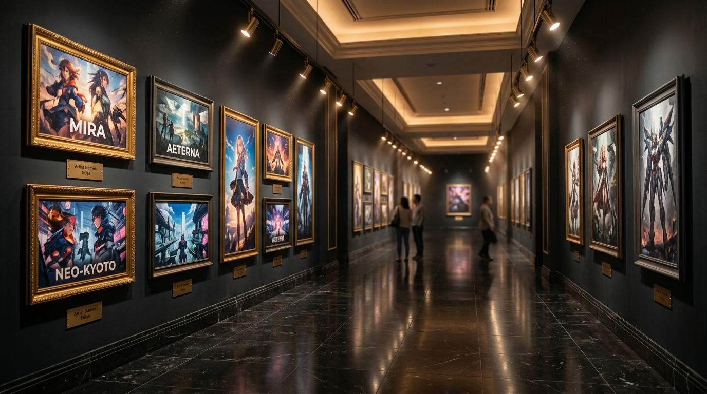

# 🎨 3D Grand Gallery · 现代深色奢华艺术展厅

基于 **Three.js (WebGL)** 构建的高性能 3D 沉浸式艺术相册与动态壁纸。包含 40 幅精选艺术画作、立体黑金雕花画框、抛光大理石地面镜面反射、天花板跌级发光灯槽与电影感自动漫游。

---

## 🌐 在线体验 (Online Demo)

> **GitHub Pages 在线直达**：  
> 👉 **[https://sun-yun-long.github.io/photo-wall-3d/](https://sun-yun-long.github.io/photo-wall-3d/)**  
> *(纯静态 WebGL 驱动，无需安装任何插件，手机与电脑浏览器均可流畅访问)*

---

## ✨ 核心特性

- **现代深色奢华艺术展厅**：黄金比例艺术长廊、炭灰哑光展墙、顶棚跌级发光灯槽与立柱柱廊，营造宁静高雅的博物馆气息。
- **高光黑大理石镜面反射**：基于 `THREE.Reflector` 打造的高清地面倒影，倒映画作、金框与灯光，并辅以细腻的自然大理石石纹与大板分缝。
- **40 幅画作立体黑金装裱**：每幅画作均配备阶梯黑漆雕花外框、香槟金箔倒角内边、米白无酸衬纸与专属纯铜艺术展签（如 `NO. 01 EXHIBITION COLLECTION`）。
- **画作全自发光色彩还原**：贴图采用 sRGB 色彩标记与自发光材质（Emissive），无论在任何暗光视角下均 100% 忠实还原原画色彩与亮度。
- **导轨艺术射灯与墙面光斑**：天花板实体悬挂射灯，在每幅画作四周与地面投下温润的暖金色漫反射光晕。
- **丁达尔浮游空气微尘**：空气中漂浮着缓缓升腾的微光尘埃粒子，增添空灵沉浸感。
- **智能混合交互与运镜**：
  - **待机自动巡游**：无操作 3 秒后，自动开启平滑的电影级慢镜头巡游，伴随轻柔的左右目光顾盼，长廊尽头平滑返航。
  - **鼠标阻尼视差 (Parallax)**：移动鼠标带有细腻自然的立体视差反馈；拖拽鼠标可自由环顾长廊。
  - **聚焦特写与快捷切画**：点击任意画作推近平视最佳视距；支持键盘 `←` / `→`（或 `A` / `D`）快捷切换上一幅/下一幅画作；按 `ESC` 或点击地面平滑退出聚焦。
- **100% 离线依赖与超低功耗**：所有 3D 库均离线存放在本地 `js/` 目录，无 CDN 依赖；全 WebGL GPU 加速，彻底告别旧版 CPU 软件渲染的高发热与卡顿。

---

## 🕹️ 快捷键与操作说明

| 动作 | 操作方式 | 说明 |
| :--- | :--- | :--- |
| **观看特写** | 鼠标左键点击任意画作 / 展框 / 展牌 | 镜头平滑推近至最佳平视距离 |
| **切换画作** | 键盘 `←` / `→` 或 `A` / `D`，或底部 `‹` / `›` 按钮 | 连续浏览上一幅 / 下一幅画作 |
| **退出特写** | 按键盘 `ESC`、空格键，或点击展厅地面 / 按钮 `✕` | 平滑退回长廊中央 |
| **自由环顾** | 按住鼠标左键并拖拽 | 自由旋转视角环视展厅四周 |
| **自动漫游开关** | 点击底部控制栏 `❚❚ 暂停巡游` / `▶ 自动漫游` | 开启或暂停镜头自动平移 |

---

## 🚀 使用指南 (3 种运行方式)

### 1. GitHub Pages 在线直接访问
上传到 GitHub 仓库后，直接在浏览器打开：  
👉 `https://sun-yun-long.github.io/photo-wall-3d/`

### 2. 本地电脑离线运行
如果把项目下载/克隆到本地电脑：
1. **双击运行项目根目录下的 `start_server.bat`**。
2. 脚本会自动启动超轻量本地服务并自动在默认浏览器中打开页面：  
   `http://localhost:8089/index.html`  
   *(注：使用此方式可完美绕过现代浏览器对本地 `file:///` 协议加载 WebGL 纹理的安全限制)*。

### 3. 作为 Wallpaper Engine 动态壁纸使用
1. 打开 **Wallpaper Engine**。
2. 点击左下角的 **“从文件打开” (Open from File)**。
3. 选择本项目根目录下的 **`project.json`** 或 **`index.html`**。
4. 即可在桌面享受完整的 3D 艺术展厅动态壁纸！  
   可在 Wallpaper Engine 右侧属性栏实时调节：
   - 待机自动漫游开关
   - 漫游速度 (Cruise Speed)
   - 大理石地面反射强度 (Floor Reflection)
   - 展厅射灯色温 (暖金 / 自然白 / 冷调)
   - 丁达尔空气微尘粒子开关

---

## 🛠️ GitHub Pages 开启步骤

如果你刚刚 fork 或推送了本仓库，在 GitHub 上开启 Pages 服务只需一步：
1. 打开你的 GitHub 仓库主页。
2. 点击顶部 **Settings** -> 左侧菜单 **Pages**。
3. 在 **Build and deployment** 下的 **Branch** 选项中：
   - 分支选择：`main`
   - 目录选择：`/(root)`
   - 点击 **Save** 保存。
4. 等待 1~2 分钟，页面顶部即会显示你的在线访问链接！

---

## 📄 开源许可

本项目基于 MIT License 开源。
